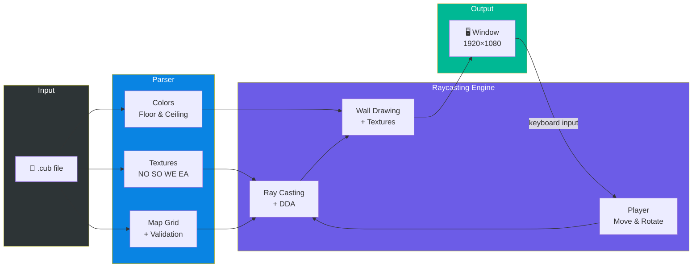
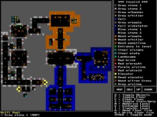
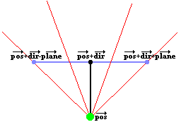
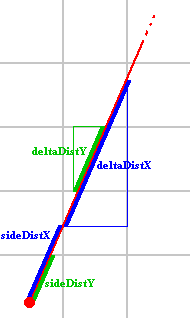
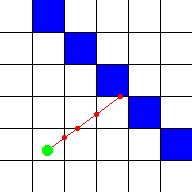
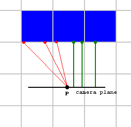

# cub3D

### A 3D Game Engine Built from Scratch Using Raycasting

A first-person perspective renderer built in C using the same technique that powered Wolfenstein 3D (1992). Renders textured walls, colored floors/ceilings, and smooth player movement in real time from a 2D map.

Built as part of the [42 School](https://42.fr/) curriculum using the [MiniLibX](https://github.com/42Paris/minilibx-linux) graphics library.

<div align="center">

[](https://42.fr)
[](https://en.wikipedia.org/wiki/C_(programming_language))
[](https://github.com/42School/norminette)
[](LICENSE)

</div>

<div align="center">
  
</div>

---

## Table of Contents

- [Architecture](#architecture)
- [What is Raycasting?](#what-is-raycasting)
- [How It Works](#how-it-works)
  - [The Core Loop](#the-core-loop)
  - [Step 1 — Ray Initialization](#step-1--ray-initialization)
  - [Step 2 — DDA Algorithm](#step-2--dda-algorithm)
  - [Step 3 — Wall Distance & Height](#step-3--wall-distance--height)
  - [Step 4 — Texture Mapping](#step-4--texture-mapping)
  - [Step 5 — Drawing](#step-5--drawing)
- [Player Movement & Rotation](#player-movement--rotation)
- [Collision Detection & Wall Sliding](#collision-detection--wall-sliding)
- [Map Parsing](#map-parsing)
- [Memory Management](#memory-management)
- [Project Structure](#project-structure)
- [Requirements](#requirements)
- [Installation & Usage](#installation--usage)
- [Controls](#controls)
- [Map Format (.cub)](#map-format-cub)
- [Error Handling](#error-handling)
- [Resources](#resources)
- [Authors](#authors)

---

## Architecture



---

## What is Raycasting?

Raycasting is a rendering technique that creates a 3D perspective from a 2D map. Unlike true 3D rendering (which processes full 3D geometry), raycasting casts one ray per vertical screen column from the player's position. Each ray travels through the 2D grid until it hits a wall. The distance to that wall determines how tall the wall stripe appears on screen.

**Key idea:** Closer walls → taller stripes. Farther walls → shorter stripes. This creates the illusion of depth.

This technique was revolutionary in the early 1990s because it allowed real-time 3D-looking graphics on hardware that couldn't handle actual 3D polygon rendering. Games like **Wolfenstein 3D** and **Doom** popularized this approach.

<div align="center">
  
  
  <br>
  <em>Left: Wolfenstein 3D's 3D view — Right: Its 2D grid map (each square = wall or empty space)</em>
</div>

---

## How It Works

### The Core Loop

For every frame, the engine loops through each vertical column of the screen (0 to `WIDTH - 1`) and performs these steps:

```
For each column x on the screen:
  1. Initialize a ray from the player through that column
  2. Step through the grid using DDA until a wall is hit
  3. Calculate the perpendicular distance to the wall
  4. Determine wall height from the distance
  5. Pick the correct texture and draw the column
```

This happens in `raycasting.c`:

```c
void ray_casting(t_cub *cub)
{
    int x = 0;
    while (x < screen_width)
    {
        init_ray(cub, &ray, x);
        calculate_step_and_side_dist(&ray, &player);
        perform_dda(cub, &ray);
        calculate_wall_distance(&ray, &player, screen_height);
        texture_num = determine_texture(&ray);
        calculate_texture_x(&ray, &player);
        draw_vertical_line(cub, &ray, x, texture_num);
        x++;
    }
}
```

---

### Step 1 — Ray Initialization

Each ray starts at the player's position and points in a direction determined by the player's view direction plus an offset based on the camera plane.

**Formula:**

$$\text{camera\\_x} = \frac{2x}{W} - 1$$

This maps the current screen column `x` to a value between `-1` (left edge) and `+1` (right edge). The center of the screen is `0`.

$$\text{ray\\_dir} = \text{dir} + \text{plane} \times \text{camera\\_x}$$

- `dir` = the direction the player is facing (a unit vector)
- `plane` = the camera plane vector (perpendicular to `dir`), its length controls the FOV

<div align="center">
  
  <br>
  <em>The green dot is the player position, the black line is the direction vector, and the blue line is the camera plane. Red lines are rays cast through the camera plane.</em>
</div>

The **delta distances** determine how far a ray must travel to cross one grid line:

$$\Delta_x = \left|\frac{1}{\text{ray\\_dir\\_x}}\right|, \quad \Delta_y = \left|\frac{1}{\text{ray\\_dir\\_y}}\right|$$

If a ray direction component is `0`, we set the corresponding delta to a very large number (`1e30`) to avoid division by zero.

---

### Step 2 — DDA Algorithm

**DDA (Digital Differential Analyzer)** is a fast grid traversal algorithm. It steps through grid cells one at a time — always choosing the axis where the next grid line is closer.

**How it works:**

1. From the player position, calculate the distance to the first grid line in X and Y (these are called `side_dist_x` and `side_dist_y`)
2. Whichever is smaller — step in that direction
3. After stepping, add `delta_dist` to the side distance for that axis
4. Repeat until a wall (`'1'`) is hit

```
Player at (2.3, 1.7):
  side_dist_x = distance to x=3 (or x=2) grid line
  side_dist_y = distance to y=2 (or y=1) grid line

Step in whichever direction is closer:
  if side_dist_x < side_dist_y → step in X
  else → step in Y
```

**Formulas for initial side distances:**

If the ray points right (`dir_x > 0`):

$$\text{side\\_dist\\_x} = (\text{map\\_x} + 1 - \text{pos\\_x}) \times \Delta_x$$

If the ray points left (`dir_x < 0`):

$$\text{side\\_dist\\_x} = (\text{pos\\_x} - \text{map\\_x}) \times \Delta_x$$

Same logic applies to Y.

The algorithm also tracks `side` — whether the last step was in X (`side = 0`) or Y (`side = 1`). This determines which wall face was hit (and therefore which texture to use).

<div align="center">
  
  
  <br>
  <em>Left: sideDistX, sideDistY, and deltaDist values — Right: DDA stepping exactly at grid boundaries</em>
</div>

A maximum step limit prevents infinite loops on edge cases.

---

### Step 3 — Wall Distance & Height

Once a wall is hit, we need the **perpendicular distance** to it (not the Euclidean distance — that would cause a fisheye effect).

**Perpendicular distance formula:**

If the wall was hit on the X-axis (`side == 0`):

$$d_{\perp} = \frac{\text{map\\_x} - \text{pos\\_x} + \frac{1 - \text{step\\_x}}{2}}{\text{ray\\_dir\\_x}}$$

If hit on the Y-axis (`side == 1`):

$$d_{\perp} = \frac{\text{map\\_y} - \text{pos\\_y} + \frac{1 - \text{step\\_y}}{2}}{\text{ray\\_dir\\_y}}$$

**Why perpendicular?** If we used the actual straight-line distance, walls would appear curved (fisheye distortion). The perpendicular distance measures only the component along the player's viewing direction, keeping walls straight.

<div align="center">
  
  <br>
  <em>Red lines = Euclidean distance (causes fisheye) — Green lines = perpendicular distance (correct)</em>
</div>

**Wall height on screen:**

$$\text{line\\_height} = \frac{H}{d_{\perp}}$$

Where `H` is the screen height. The wall strip is then centered vertically:

$$\text{draw\\_start} = \frac{H}{2} - \frac{\text{line\\_height}}{2}$$
$$\text{draw\\_end} = \frac{H}{2} + \frac{\text{line\\_height}}{2}$$

Both values are clamped to `[0, H-1]` to stay within screen bounds.

---

### Step 4 — Texture Mapping

**Which texture?** Determined by wall orientation and ray direction:

| Side hit | Ray direction | Wall face | Texture |
|----------|--------------|-----------|---------|
| X-axis   | ray_dir_x > 0 | East wall | `EA` |
| X-axis   | ray_dir_x < 0 | West wall | `WE` |
| Y-axis   | ray_dir_y > 0 | South wall | `SO` |
| Y-axis   | ray_dir_y < 0 | North wall | `NO` |

**Texture X coordinate (`tex_x`):**

The exact point where the ray hits the wall surface:

$$\text{wall\\_x} = \begin{cases} \text{pos\\_y} + d_{\perp} \times \text{ray\\_dir\\_y} & \text{if side = 0 (X hit)} \\ \text{pos\\_x} + d_{\perp} \times \text{ray\\_dir\\_x} & \text{if side = 1 (Y hit)} \end{cases}$$

$$\text{wall\\_x} = \text{wall\\_x} - \lfloor\text{wall\\_x}\rfloor \quad \text{(fractional part only)}$$

$$\text{tex\\_x} = \text{wall\\_x} \times \text{TEXTURE\\_SIZE}$$

The `tex_x` is flipped in certain cases to ensure textures aren't mirrored.

**Texture Y coordinate (`tex_y`):**

For each pixel in the vertical wall strip:

$$\text{step} = \frac{\text{TEXTURE\\_SIZE}}{\text{line\\_height}}$$

$$\text{tex\\_pos} = (\text{draw\\_start} - \frac{H}{2} + \frac{\text{line\\_height}}{2}) \times \text{step}$$

$$\text{tex\\_y} = \lfloor\text{tex\\_pos}\rfloor \mod \text{TEXTURE\\_SIZE}$$

The `tex_pos` increments by `step` for each pixel drawn.

---

### Step 5 — Drawing

For each screen column, three regions are drawn directly to the image buffer:

1. **Ceiling** — From `y = 0` to `draw_start`, filled with the ceiling color
2. **Wall** — From `draw_start` to `draw_end`, sampled from the texture
3. **Floor** — From `draw_end + 1` to `HEIGHT`, filled with the floor color

Pixels are written directly to the image memory buffer using pointer arithmetic for maximum performance:

```c
// Pixel address = base + (y * line_size) + (x * bytes_per_pixel)
*(unsigned int *)(addr + y * size_line + x * bpp) = color;
```

---

## Player Movement & Rotation

### Movement

The player moves along their direction vector. Forward/backward moves along `dir`, strafing moves perpendicular to it.

**Forward/Backward:**

$$\text{new\\_x} = \text{pos\\_x} + \text{dir\\_x} \times \text{speed} \times \text{direction}$$
$$\text{new\\_y} = \text{pos\\_y} + \text{dir\\_y} \times \text{speed} \times \text{direction}$$

Where `direction` is `+1` (forward) or `-1` (backward).

**Strafing (left/right):**

$$\text{new\\_x} = \text{pos\\_x} - \text{dir\\_y} \times \text{speed} \times \text{direction}$$
$$\text{new\\_y} = \text{pos\\_y} + \text{dir\\_x} \times \text{speed} \times \text{direction}$$

The strafe vector `(-dir_y, dir_x)` is perpendicular to the direction vector.

### Rotation

Rotation uses a 2D rotation matrix to rotate both the direction and camera plane vectors:

$$\begin{pmatrix} \text{dir\\_x'} \\ \text{dir\\_y'} \end{pmatrix} = \begin{pmatrix} \cos\theta & -\sin\theta \\ \sin\theta & \cos\theta \end{pmatrix} \begin{pmatrix} \text{dir\\_x} \\ \text{dir\\_y} \end{pmatrix}$$

The same rotation is applied to the camera plane vector. The angle `θ` equals `ROTATION_SPEED * direction` per frame.

### Field of View (FOV)

The FOV is controlled by the length of the camera plane vector relative to the direction vector:

$$|\text{plane}| = \tan\left(\frac{\text{FOV}}{2}\right)$$

With `FOV = 60°`, this gives `|plane| = tan(30°) ≈ 0.577`. The plane is always perpendicular to the direction vector.

---

## Collision Detection & Wall Sliding

The collision system prevents the player from walking through walls and enables wall sliding for smooth movement.

**Basic collision:** Check if the target grid cell is a wall (`'1'`).

**Wall sliding:** When a diagonal move is blocked, the engine tries each axis independently:
- Can we move only in X? → slide along the X axis
- Can we move only in Y? → slide along the Y axis

This prevents the player from getting "stuck" on walls and creates a natural sliding motion along surfaces.

---

## Map Parsing

The parser reads `.cub` files in this order:

1. **Validate file extension** — must end with `.cub`
2. **Read all lines** into memory
3. **Parse texture paths** — identifiers `NO`, `SO`, `WE`, `EA` followed by `.xpm` file paths
4. **Parse colors** — `F` (floor) and `C` (ceiling) with RGB values `R,G,B` (0–255 each)
5. **Parse the map grid** — the 2D array of characters
6. **Validate map** — character check, player count, wall closure

### Map Validation Checks

| Check | Rule |
|-------|------|
| File extension | Must be `.cub` |
| Textures | All four (`NO`, `SO`, `WE`, `EA`) must be valid `.xpm` files |
| Colors | Both `F` and `C` must have valid RGB values (0–255) |
| Map characters | Only `0`, `1`, `N`, `S`, `E`, `W`, and spaces allowed |
| Player count | Exactly one player position (`N`, `S`, `E`, or `W`) |
| Map closure | All walkable tiles (`0` and player) must be surrounded by walls — verified with neighbor checking AND flood fill |
| No duplicates | Texture and color identifiers cannot be repeated |

---

## Memory Management

The project uses a **custom garbage collector** (`mem_collector`). Every allocation goes through `ft_malloc()`, which tracks all pointers in a linked list. On exit (or error), `ft_free()` releases everything at once.

```
ft_malloc(size)
  → malloc(size)
  → create tracking node
  → add to linked list head
  → return pointer

ft_free(exit_val)
  → walk linked list
  → free each pointer and node
  → if exit_val != 0, call exit(1)
```

This means:
- No manual `free()` calls needed for individual allocations
- Memory leaks are prevented on any error path
- Clean shutdown with guaranteed cleanup

---

## Project Structure

```
cub3D/
├── Makefile                    # Build system
├── maps/
│   ├── good/                   # Valid test maps
│   │   ├── subject_map.cub     # Map from 42 subject PDF
│   │   ├── cheese_maze.cub     # Complex maze
│   │   └── ...
│   └── bad/                    # Invalid maps (for error testing)
│       ├── player_none.cub     # No player position
│       ├── color_invalid_rgb.cub
│       └── ...
├── textures/
│   ├── wolfenstein/            # Wolfenstein-style textures
│   ├── simonkraft/             # Minecraft-style textures
│   └── test/                   # Basic test textures
└── src/
    ├── raycasting/
    │   ├── cub3d.c             # Entry point (main)
    │   ├── cub3d.h             # Main header with all structs/defines
    │   ├── raycasting.c        # Core raycasting loop
    │   ├── ray_init.c          # Ray initialization & step calculation
    │   ├── ray_dda.c           # DDA grid traversal & wall distance
    │   ├── ray_texture.c       # Texture selection & coordinate mapping
    │   ├── ray_draw.c          # Ceiling, wall, floor drawing
    │   ├── player.c            # Player rotation
    │   ├── player_init.c       # Player orientation setup
    │   ├── player_move.c       # Player movement & sliding
    │   ├── collision.c         # Collision detection
    │   ├── window.c            # Window creation & key handling
    │   ├── window_loop.c       # Input processing
    │   ├── window_loop2.c      # Game loop (render every frame)
    │   └── memory.c            # Resource cleanup (textures, MLX)
    ├── parsing/
    │   ├── parser.h            # Parser header
    │   ├── parser_utils.c      # String utilities for parsing
    │   ├── memory.c            # Resource deallocation
    │   ├── parser/
    │   │   ├── parser_1.c      # Main parser logic & entry
    │   │   ├── parser_2.c      # File extension, line counting, tokenizing
    │   │   └── parser_3.c      # Token normalization, file line reading
    │   ├── textures/
    │   │   ├── textures.c      # Texture loading (XPM → image)
    │   │   ├── textures_1.c    # Texture path assignment & validation
    │   │   └── textures_2.c    # Individual texture assignment (NO/SO/WE/EA)
    │   ├── colors/
    │   │   ├── colors_1.c      # RGB parsing & color assignment
    │   │   └── colors_2.c      # RGB validation & conversion
    │   └── map/
    │       ├── map_1.c         # Player position, neighbor checking
    │       ├── map_2.c         # Map grid allocation & character validation
    │       ├── map_3.c         # Flood fill & wall closure validation
    │       └── map_4.c         # Row validation, player finding, main map loader
    └── utils/
        ├── utils.h             # Utility function declarations
        ├── ft_split.c          # String splitting by delimiter
        ├── ft_strcmp.c          # String comparison
        ├── ft_strlen.c         # String length
        ├── ft_strrchr.c        # Find last char occurrence
        ├── ft_isspace.c        # Whitespace check
        ├── ft_memset.c         # Memory fill
        ├── ft_memcpy.c         # Memory copy
        ├── ft_putstr_fd.c      # Write string to file descriptor
        ├── ft_itoa.c           # Integer to string
        ├── get_next_line/
        │   ├── get_next_line.c # Read file line by line
        │   ├── get_next_line_utils.c
        │   └── get_next_line.h
        └── mem_collector/
            ├── mem_collector.c # Custom garbage collector
            └── mem_collector.h
```

---

## Requirements

- **OS:** Linux (uses X11 window system)
- **Compiler:** `cc` (GCC or Clang) with `-Wall -Wextra -Werror`
- **MiniLibX:** Must be installed at `/usr/include/minilibx-linux/`
- **Libraries:** `libX11`, `libXext`, `libm` (math)

### Installing MiniLibX

```bash
# Install X11 development libraries
sudo apt-get install libx11-dev libxext-dev libbsd-dev

# Clone and install MiniLibX
git clone https://github.com/42Paris/minilibx-linux.git /usr/include/minilibx-linux
cd /usr/include/minilibx-linux
make
```

---

## Installation & Usage

```bash
# Clone the repository
git clone https://github.com/your-username/cub3D.git
cd cub3D

# Build
make

# Run with a map
./cub3D maps/good/subject_map.cub

# Try other maps
./cub3D maps/good/cheese_maze.cub
./cub3D maps/good/library.cub
./cub3D maps/good/creepy.cub

# Rebuild
make re

# Clean object files
make clean

# Clean everything
make fclean
```

---

## Controls

| Key | Action |
|-----|--------|
| `W` | Move forward |
| `S` | Move backward |
| `A` | Strafe left |
| `D` | Strafe right |
| `←` | Rotate camera left |
| `→` | Rotate camera right |
| `ESC` | Quit |

---

## Map Format (.cub)

A `.cub` file has two sections: **assets** (textures + colors) and the **map grid**.

### Example

```
NO textures/wolfenstein/grey_stone.xpm
SO textures/wolfenstein/purple_stone.xpm
WE textures/wolfenstein/red_brick.xpm
EA textures/wolfenstein/wood.xpm

F 220,100,0
C 225,30,0

        1111111111111111111111111
        1000000000110000000000001
        1011000001110000000000001
        1001000000000000000000001
111111111011000001110000000000001
100000000000000001110111111111111
11110111111111011100000010001
11110111111111011101010010001
11000000110101011100000000001
10000000000000001100000010001
10000000000000001101010010001
11000001110101011111011110N0111
11110111 1110101 101111010001
11111111 1111111 111111111111
```

### Asset Lines

| Identifier | Description | Format |
|-----------|-------------|--------|
| `NO` | North wall texture | Path to `.xpm` file |
| `SO` | South wall texture | Path to `.xpm` file |
| `WE` | West wall texture | Path to `.xpm` file |
| `EA` | East wall texture | Path to `.xpm` file |
| `F` | Floor color | `R,G,B` (0–255 each) |
| `C` | Ceiling color | `R,G,B` (0–255 each) |

### Map Characters

| Character | Meaning |
|----------|---------|
| `0` | Empty / walkable space |
| `1` | Wall |
| `N` | Player spawn facing North |
| `S` | Player spawn facing South |
| `E` | Player spawn facing East |
| `W` | Player spawn facing West |
| ` ` | Void (outside the map) |

### Map Rules

- The map must be the last element in the file
- The map must be fully closed/surrounded by walls (`1`)
- Exactly one player spawn position is required
- Only the characters listed above are allowed
- Spaces represent areas outside the playable map

---

## Error Handling

The program validates everything before launching the game. All errors print to `stderr` with a clear message:

| Error | Message |
|-------|---------|
| Wrong argument count | `Usage: ./cub3D <map_path>` |
| Wrong file extension | `Invalid file extension. Expected .cub` |
| Cannot open file | `Unable to open map file` |
| Invalid texture path | `Invalid north/south/west/east texture path` |
| Invalid color format | `Invalid floor or ceiling color` |
| Invalid map character | `Invalid character in map` |
| Missing/multiple player | `Map must contain exactly one player` |
| Map not closed | `Map is not closed by walls` |
| Texture load failure | `Failed to load texture: <path>` |
| Content after map | `Invalid lines detected after map section` |

---

## Resources

### Raycasting Theory
- [Lode's Raycasting Tutorial](https://lodev.org/cgtutor/raycasting.html) — The definitive raycasting guide. This project follows its approach closely.
- [Ray-Casting Tutorial by F. Permadi](https://permadi.com/1996/05/ray-casting-tutorial-table-of-contents/) — Another excellent visual tutorial from 1996.

### Math Background
- [2D Rotation Matrix](https://en.wikipedia.org/wiki/Rotation_matrix) — Used for player rotation.
- [Digital Differential Analyzer (DDA)](https://en.wikipedia.org/wiki/Digital_differential_analyzer_(graphics_algorithm)) — The grid traversal algorithm used for raycasting.
- [Field of View in Video Games](https://en.wikipedia.org/wiki/Field_of_view_in_video_games) — Understanding FOV and the camera plane.

### MiniLibX
- [MiniLibX Documentation](https://harm-smits.github.io/42docs/libs/minilibx) — Complete docs for the graphics library.
- [MiniLibX Linux Source](https://github.com/42Paris/minilibx-linux) — Official repository.

### 42 Project
- [42 cub3D Subject PDF](https://cdn.intra.42.fr/pdf/pdf/138728/en.subject.pdf) — Official project requirements.

### Historical Context
- [Wolfenstein 3D (Wikipedia)](https://en.wikipedia.org/wiki/Wolfenstein_3D) — The game that pioneered this technique.
- [Game Engine Black Book: Wolfenstein 3D](https://fabiensanglard.net/gebbwolf3d/) by Fabien Sanglard — Deep dive into the original engine.

---

## Authors

- **bchiki** — [GitHub](https://github.com/oCHIKIo)
- **mhaddou** — [GitHub](https://github.com/haddoumounir)

---

<sub>Raycasting diagrams from [Lode's Computer Graphics Tutorial](https://lodev.org/cgtutor/raycasting.html) by Lode Vandevenne.</sub>
